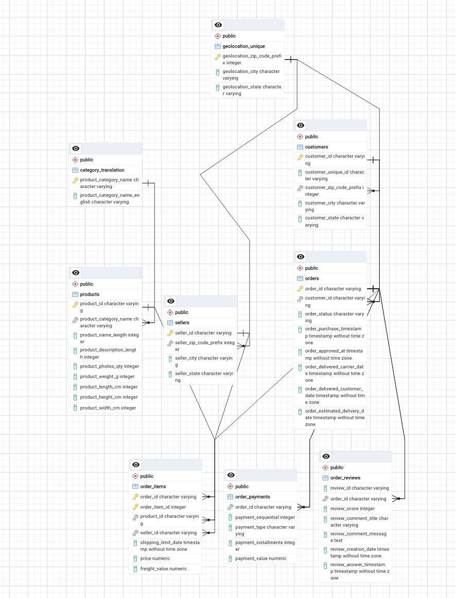

# Data-Visualization
## Olist E-commerce Analytics Project

A comprehensive data analysis and visualization project for Olist, a Brazilian e-commerce marketplace that connects small businesses with major online platforms.

## 📊 Project Overview

This project analyzes the Olist e-commerce dataset to extract valuable business insights through SQL queries, Python visualizations, and interactive dashboards.

## 🗃️ Database Schema



The database contains 9 interconnected tables:
- `orders` - Order details and timestamps
- `customers` - Customer demographic and location data  
- `sellers` - Seller information
- `products` - Product metadata and categories
- `order_items` - Products included in orders
- `order_payments` - Payment methods and transactions
- `order_reviews` - Customer reviews and ratings
- `geolocation` - Customer and seller locations
- `category_translation` - Product categories in English

## 🎯 Project Goals

- Perform **sales and logistics analytics**
- Analyze customer behavior and seller performance  
- Visualize order statistics and delivery patterns
- Explore product categories and review distributions
- Create interactive dashboards and automated reports

## 📁 Project Structure
Data-Visualization/
├── analytics.py # Main analytics script with visualizations
├── main.py # Database connection and sample queries
├── queries.sql # 10 analytical SQL queries
├── schema.sql # Database table definitions
├── data.sql # Data import commands
├── requirements.txt # Python dependencies
├── README.md # Project documentation
├── charts/ # Generated visualization images
├── exports/ # Excel reports with formatting
├── db/ # CSV data files
└── images/ # Diagrams and ERD

## 🚀 Quick Start

### Prerequisites
- PostgreSQL 16+
- Python 3.12+
- Git

### 1. Database Setup

# Create database
createdb ecommerce

# Create tables
psql -U postgres -d ecommerce -f schema.sql

# Import data
psql -U postgres -d ecommerce -f data.sql


### 2. Database Setup
# Install dependencies
pip install -r requirements.txt

# Run analytics
python analytics.py

### 3. Explore Queries
# Run analytical queries
psql -U postgres -d ecommerce -f queries.sql

## 📈 Features

### Data Visualizations
The project creates 6 different types of analytical charts:

- **Pie Chart**: Order status distribution
- **Bar Chart**: Top product categories by revenue
- **Horizontal Bar**: Average review scores by state
- **Line Chart**: Delivery time trends over time
- **Histogram**: Review score distribution with percentages
- **Scatter Plot**: Price vs product weight analysis with trend lines

### Interactive Dashboard
- Time-slider visualization using Plotly
- Animated charts showing order trends over time
- Interactive filtering by customer state and time periods

### Automated Excel Reports
- Professional Excel exports with multiple sheets
- Conditional formatting for numerical data
- Frozen headers and column filters
- Gradient color scales for better data visualization

## 🔧 Technical Stack

- **Database**: PostgreSQL
- **Backend**: Python with psycopg2
- **Data Analysis**: Pandas, NumPy
- **Visualization**: Matplotlib, Plotly
- **Reporting**: OpenPyXL for Excel exports
- **Database ORM**: SQLAlchemy

## 📊 Analytical Insights

The project answers key business questions:

- **Sales Analysis**: Top product categories by revenue and order volume
- **Customer Insights**: Review score distribution and regional preferences
- **Logistics**: Delivery time trends and performance metrics
- **Payment Analysis**: Popular payment methods and average transaction values
- **Product Analysis**: Relationship between product attributes and pricing

## 🛠️ Usage

### Running the Full Analytics Pipeline
```bash
python analytics.py